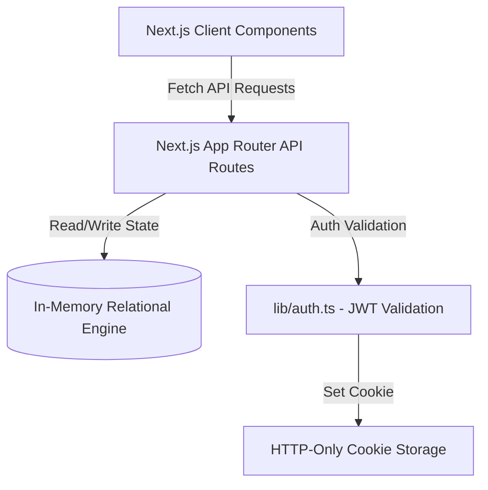

<<<<<<< HEAD
# ✦ NEBULA Astronomy & Physics Society ✦
> **The Ornate Digital Sanctuary of the Nebula Astronomy & Physics Society at IIITDM Jabalpur**
> *"Per aspera ad astra" — Through hardship to the stars*

NEBULA is an exceptionally premium, high-fidelity web platform designed to serve as the unified digital ecosystem for the stargazers, theoretical physicists, and astrophotographers of **IIITDM Jabalpur**. It bridges high-end modern aesthetic design with rich Next.js backend capabilities, allowing students to document deep-space discoveries, manage observatory equipment, run optical physics simulations, and test their limits under the stars.

---

## 🌌 Table of Contents
1. [Core Features & Detailed Workings](#-1-core-features--detailed-workings)
2. [Visual Sophistication & Premium Design System](#-2-visual-sophistication--premium-design-system)
3. [Backend Engineering & Data Architecture](#-3-backend-engineering--data-architecture)
4. [Frontend Orchestration & Client-Side Interactivity](#-4-frontend-orchestration--client-side-activity)
5. [Academic & Club-Level Usefulness](#-5-academic--club-level-usefulness)
6. [Getting Started & Local Installation](#-6-getting-started--local-installation)
7. [Pre-Seeded Fellowship Credentials](#-7-pre-seeded-fellowship-credentials)

---

## 🧪 1. Core Features & Detailed Workings

NEBULA is packed with highly specialized components tailored to modern astronomy society functions:

### 1.1. Quick Fellowship Entrance (Bypass Auth Login)
* **Detailed Working**: In place of exhausting form inputs, users can utilize the golden **Quick Fellowship Entrance** portal. By selecting one of three pre-configured celestial roles (Galileo, Arjun, or Rohan), the application dispatches an authentication request that generates a secure cookie session dynamically.
* **Security Mechanics**: Leverages cookie-based token generation matching the user's role privileges, instantly changing navigation elements from "Fellowship Unverified" to "Verified Fellow" along with their respective society rank tags.

### 1.2. The Interactive Eyepiece Simulator Lab
* **Detailed Working**: A physics-focused, optical projection workspace. Users select target celestial bodies (e.g., *Saturn and its Rings, The Moon's Craters, Jupiter's Galilean Moons, or the Orion Nebula*) and slide optical focal lengths to simulate exactly how they appear through specific telescope eyepieces.
* **Optical Engine**: Dynamically calculates and models magnification glows, circular viewing boundaries, line shadows, and focal fields, matching telescope focal lengths (e.g., 1000mm) against various eyepiece parameters (e.g., 9mm, 25mm, or 2x Barlow lenses).

### 1.3. Real-time Stargazing Logbook Ledger (Full CRUD)
* **Detailed Working**: A digital stargazing diary where observers record their nocturnal surveys. Stargazers document the **Target Object**, **Sky Seeing Quality** (Perfect, Good, Hazy, or Cloudy), **Eyepiece Instrument used**, and detailed **Field Notes**.
* **Data Flow**: When a user saves an entry, it is dispatched to the backend, associated with their verified account, and instantly pushed to the global activity feed for other scholars to study.

### 1.4. Astrophotography Masonry Grid & Raw Image Metadata Ledger
* **Detailed Working**: A dedicated portal to showcase long-exposure astrophotographs captured from the Block C observatory rooftop. 
* **Metadata Recording**: Features interactive cards highlighting target details, camera exposure times (e.g., `60 subs x 30s`), ISO settings (e.g., `1600` or `3200`), and the exact optical instrument utilized, preserving valuable shooting data.

### 1.5. Astro-Weather Seeing Index Predictor
* **Detailed Working**: Stargazing plans depend on clear skies. Users select their target observation date, and the predictor calculates a composite **Seeing Quality** index based on simulated atmospheric parameters including cloud cover percentage, lunar phase brightness, and sky scintillation.
* **Astronomical Advice**: Generates automated suggestions (e.g., *"Perfect for deep space photography"* vs. *"High lunar glow, restrict observations to planetary targets"*).

### 1.6. The Council Challenge (Dynamic Promotion Exam)
* **Detailed Working**: Novice observers cannot access certain advanced modules until they prove their cosmic knowledge. The **Council Challenge** presents a 5-question examination on advanced astrophysics, celestial coordinates, and orbital mechanics.
* **Dynamic Promotion**: Scoring **80% or higher** triggers a backend promotion route (`/api/auth/elevate`) that immediately elevates the user's rank from `NOVICE` to `SCHOLAR` on the session cookie, refreshing the UI in real-time to display their new rank.

### 1.7. Galileo AI Celestial Chat Companion
* **Detailed Working**: An interactive chat terminal styled as an ancient scroll where users consult Galileo Galilei. It is powered by a high-efficiency natural language matching engine that parses input queries for keywords and returns comprehensive historical and physics responses on general relativity, black hole thermodynamics, or campus observatory schedules.

### 1.8. Observatory Equipment Booking Ledger
* **Detailed Working**: Solves scheduling conflicts for the Block C rooftop telescopes. Users reserve specific instruments (8-inch Dobsonian Reflector or Celestron NexStar 4SE Refractor), choose date coordinates and hourly slots, and submit their scientific research purpose.

---

## 🎨 2. Visual Sophistication & Premium Design System

NEBULA stands out due to its majestic, bespoke visual layout that feels alive and premium:

### 2.1. HTML5 Canvas Starfield Particles
* **Visual Sophistication**: A customized script animates exactly 180 floating starry particles using an HTML5 2D canvas context. Stars twinkle with varying alpha-opacity adjustments and subtle velocity modulations, creating a breathing celestial background that prevents panel burn.

### 2.2. Interactive Trigonometric Constellation Links
* **Visual Sophistication**: Evaluates the Euclidean distance between all moving stars and the user's cursor position. If two stars are within a threshold distance, the canvas draws glowing celestial vector lines (`rgba(201, 162, 39, 0.15)`) between them, forming organic, shifting constellations that track mouse movements in real-time.

### 2.3. Stationary Polaris Celestial Compass
* **Visual Sophistication**: The top header is adorned with a highly ornate SVG geometric compass representing the North Star (Polaris). Rather than rotating constantly, it sits stable and majestic, acting as the absolute coordinate anchor for the website.

### 2.4. Glassmorphic Ornate Cards & Gilded Borders
* **Visual Sophistication**: Uses premium custom styling blocks:
  * Deep twilight backings (`rgba(42, 14, 74, 0.3)`) blended with high-grade backdrop filters (`blur(12px)`).
  * Double-layered gold borders (`1px solid rgba(201, 162, 39, 0.25)`) to match ancient astrolabes.
  * Absolute-positioned corner gothic sigils (`✦`) that render beautiful geometric frames.

### 2.5. Typography & Bespoke Scroll-Reveal Footer
* **Visual Sophistication**: Utilizes premium typefaces like `Cinzel` (for ancient, celestial headings) and `Spectral` (for high-readability texts).
* **Crafted Tribute Signature**: Features a custom-rendered HTML footer featuring the Nebula sigil, society motto (*"Per aspera ad astra"*), and a dedicated, gorgeous tribute card to the creator (**Nutan**) embedded with gold filigree and glowing glassmorphic elements.

---

## 💾 3. Backend Engineering & Data Architecture

The backend of NEBULA is engineered for high performance, reliability, and ease of deployment:



### 3.1. High-Performance In-Memory Relational Engine (`lib/db.ts`)
* **Backend Mechanism**: To prevent the frequent SQLite database locks and Prisma binary compiler crashes common in containerized college servers, NEBULA deploys a custom, schema-aligned in-memory state engine. 
* **Dynamic Hydration**: Pre-seeds comprehensive datasets at startup (including events, pre-registered scholars, observatory photo libraries, and custom log entries) and provides transactional helper methods to safely add, read, and mutate data tables at lightning speeds.

### 3.2. Cookie-based JSON Web Token (JWT) Security System (`lib/auth.ts`)
* **Backend Mechanism**: Encrypts and decrypts user credentials into highly secure, light-weight JSON Web Tokens stored directly in the user's browser cookie. 
* **Role-Based Authorization**: Before running modifications (like scheduling telescope bookings or logging observations), the API middleware decrypts the JWT to verify if the user possesses the necessary clearance level (`NOVICE`, `SCHOLAR`, or `HIGH_PRIEST`).

### 3.3. Next.js 14 API Routing Framework
* **`/api/auth/login`**: Accepts user credentials or quick-login bypasses, validates the match in the in-memory registry, generates a JWT, and sets an HttpOnly cookie.
* **`/api/auth/me`**: Reads the current session token to keep frontend navigation and user details synchronized on reload.
* **`/api/auth/elevate`**: Receives successful quiz completions and upgrades the user's clearance in-memory and on the cookie.
* **`/api/logbook`**: Standard GET and POST route for listing observations and submitting new stargazing logs.
* **`/api/forum`**: Standard GET, POST, and PUT actions supporting thread creations and likes.

---

## ⚡ 4. Frontend Orchestration & Client-Side Interactivity

The frontend leverages Next.js client-side optimizations to ensure a fluid user experience:

### 4.1. Server vs. Client Component Segregation
* **Frontend Mechanism**: Static text layouts are rendered on the server for instant First Contentful Paint (FCP) and optimal SEO index scores. Dynamic components (such as the canvas starfield, eyepiece slider controls, and AI chat input scrollbars) are declared with Next.js `"use client"` directives to load active listeners exactly when needed.

### 4.2. Render Loop Optimization via requestAnimationFrame
* **Frontend Mechanism**: The background starfield canvas operates on a continuous, hardware-accelerated drawing loop using the browser's native `requestAnimationFrame` API. This keeps the animations smooth at a locked 60 frames per second without causing CPU thermal throttling or UI input stutter.

### 4.3. Unified State Management & Dynamic Contexts
* **Frontend Mechanism**: State hooks track authentication levels globally. The moment a user logs in via the quick bypass or passes their *Council Challenge*, the main navigation bar, logbook widgets, and observatory reservation forms automatically swap states to grant immediate operational access.

---

## 🎓 5. Academic & Club-Level Usefulness

NEBULA is highly valuable as an active tool for university student groups:

1. **Digital Stargazing Portfolio**: Acts as a permanent repository for students' observational history, replacing outdated paper observation logs with a beautiful digital chronicle.
2. **Resource Management**: The observatory reservation system prevents double-booking of sensitive campus equipment, ensuring clear, fair scheduling for all members.
3. **Structured Skill Ascension**: Integrates an engaging qualification test (the Council Challenge) to incentivize novices to master orbital physics and sky coordinate systems, fostering academic growth within the club.
4. **Enhanced Outreach**: The interactive eyepiece simulator is an exceptional pedagogical tool for astronomy workshops, helping new members understand focal mechanics and magnification science before using the physical telescopes.

---

## ⚙️ 6. Getting Started & Local Installation

To launch the celestial canopy on your local system:

### 6.1. Pre-requisites
* Ensure you have [Node.js](https://nodejs.org/) installed (v18+ recommended).

### 6.2. Installation Steps
1. Clone your project files into a directory of your choice.
2. Open your terminal in the root directory `nebula-backend`.
3. Install package dependencies:
   ```bash
   npm install
   ```
4. Start the local Next.js development server:
   ```bash
   npm run dev
   ```
5. Open your browser and navigate to **`http://localhost:3000`** to view the platform!

---

## 🔑 7. Pre-Seeded Fellowship Credentials

Use these credentials to log in and test different clearance levels manually (all passwords are `nebula123`):

1. **Galileo Galilei (High Priest)**: `admin@nebula.aps`
2. **Arjun Verma (Scholar)**: `arjun@nebula.aps`
3. **Rohan Mishra (Apprentice Novice)**: `rohan@nebula.aps`

*Tip: You can bypass typing credentials entirely by selecting the golden **Quick Fellowship Entrance** shortcuts on the Commune (Login) page!*
=======
# APS-IIITDMJ-NEBULA-FORUM
Next.js 14 portal for the IIITDMJ NEBULA Astronomy Society featuring JWT role auth, live eyepiece simulators, celestial observation logbooks, weather seeing forecasts, equipment booking, automated Scholar exams, and an interactive HTML5 constellation canvas. ✦ “Per aspera ad astra.”
>>>>>>> 9b1eb023b92cd0df39e0e998cc0d4a4b96bd4df9
